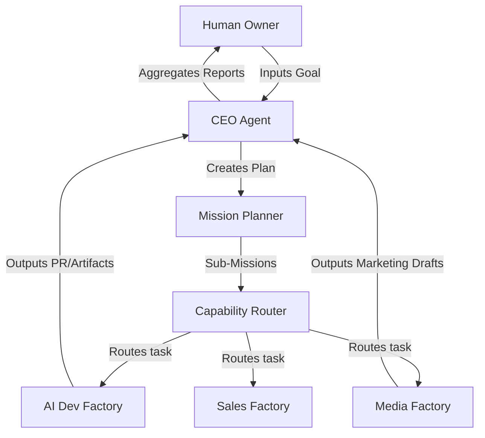

# AI Company OS: Overview

## What is AI Company OS?

The **AI Company Operating System (OS)** is a framework designed to run a business entity entirely using autonomous AI Agents. Under this operating system, specialized divisions (e.g., engineering, marketing, finance, sales) are structured as **Factories** that interact through standardized mission APIs and shared state queues.

The system is governed by **Executive Agents** (CEO, COO, CTO, CMO, CFO) who monitor operation metrics, coordinate cross-department workflows, and route tasks, all while staying strictly within safety guardrails verified by a human owner.

## Why it Exists

Conventional human organizations face significant operational overhead, coordination delays, and alignment challenges. While LLM-based autonomous workers can write code or draft documents, they lack corporate context, strategic routing, and long-term memory. 

The AI Company OS solves this by:
1. **Structuring agency**: Segmenting agents into discrete, specialized factories rather than running a single massive agent prompt.
2. **Standardizing inputs/outputs**: Routing work through structured **Missions** containing allowed scopes, safety regulations, and verification commands.
3. **Establishing owner gates**: Ensuring all critical operations (deployments, actual payments, code merges) require explicit human approval.

## AI Dev Factory vs. AI Company OS

| Feature | AI Dev Factory (Capability) | AI Company OS (System) |
| ------- | -------------------------- | ---------------------- |
| **Scope** | Code modifications, verifications, and Draft PRs. | General corporate operations (media, finance, sales, dev). |
| **Role** | A single specialized **Factory** (Engineering). | The orchestrator coordinating **all Factories**. |
| **Routing** | Executes a local queue of code-oriented tasks. | Plans high-level goals and routes them to factories. |
| **Actors** | Runner instances acquiring task locks. | Executive Agents (CEO, COO, etc.) managing corporate state. |

## High-Level Mission Flow

1. **Intake**: The Human Owner submits a high-level corporate goal.
2. **Planning**: The CEO Agent and Mission Planner break down the goal into separate, structured sub-missions.
3. **Routing**: The Capability Router matches each sub-mission to the appropriate registered Factory.
4. **Execution**: The target Factory picks, locks, and executes the sub-mission locally.
5. **Closeout**: Output artifacts are compiled, verified by safety audits, and presented to the Owner for approval.

## Milestone 1 Goals

Milestone 1 focuses on designing and implementing the static organizational structures, capability registries, mission planning algorithms, and capability routing engines necessary to transition the codebase into the AI Company OS.
