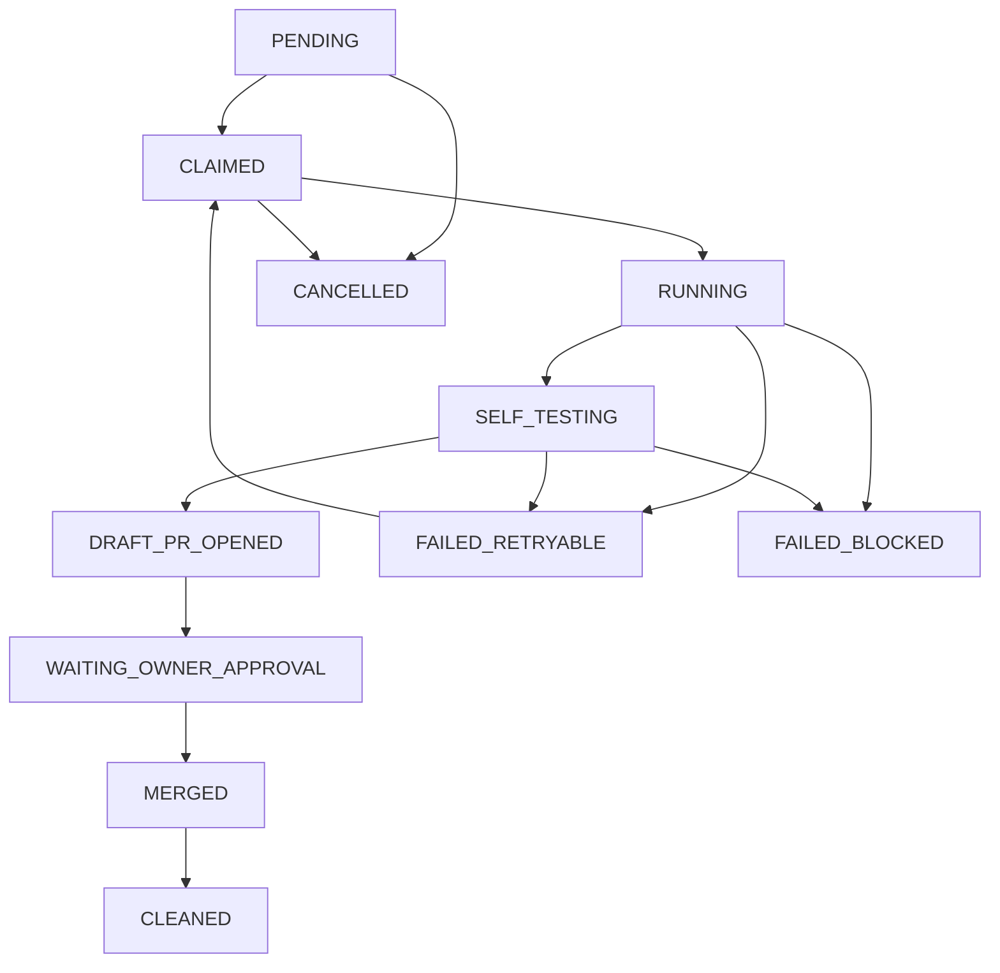

# AI Dev Factory: Mission Queue Design

This document details the architecture and lifecycle specification of the AI Dev Factory Mission Queue system.

## Why the Mission Queue Exists

As the AI Dev Factory scales from single-task executions to multi-task or concurrent pipelines, a state-tracking layer is required to ensure:
- **Scalability**: Decoupling goal retrieval from execution so multiple missions can be queued.
- **Fault Tolerance**: Resuming interrupted missions safely without re-doing already completed steps (e.g., self-testing or branch creation).
- **Auditability**: Keeping a clear log of transitions from owner goals to merged commits.
- **Idempotency**: Ensuring a mission is never executed twice, even if multiple runners pull tasks from the queue.

---

## Mission Lifecycle States

A mission progresses through the following lifecycle states:



### State Definitions:
1. **`PENDING`**: The goal has been submitted by the owner but not yet assigned.
2. **`CLAIMED`**: A specific agent or runner has locked the task for execution.
3. **`RUNNING`**: The developer workspace is initialized, the branch checked out, and code edits are actively being made.
4. **`SELF_TESTING`**: The codebase modifications have completed, and the runner is validating baseline tests (typecheck, build, unit tests) and verifier scripts.
5. **`DRAFT_PR_OPENED`**: The verification checks passed, code has been pushed, and a Draft PR has been opened on GitHub.
6. **`WAITING_OWNER_APPROVAL`**: The runner is waiting for the owner approval token (`OWNER_APPROVED_MERGE_PR=<PR_NUMBER>`) to trigger the merge path.
7. **`MERGED`**: The PR was successfully merged into master.
8. **`CLEANED`**: Post-merge local branch deletion, remote tracking cleanup, and environment restoration have completed.
9. **`FAILED_BLOCKED`**: The execution encountered a safety violation (e.g., attempting secret modifications or running out-of-scope commands) and is permanently blocked until owner intervention.
10. **`FAILED_RETRYABLE`**: A transient error occurred (e.g., a test failure or build warning). The runner can retry from the last saved state.
11. **`CANCELLED`**: The mission was manually aborted by the owner before completion.

---

## Lock & Run-ID Concept

To prevent multiple runners from executing the same mission concurrently:
- **`run_id`**: A unique UUID generated for each execution attempt.
- **`lock_file`**: When a runner claims a task, it writes a `mission.lock` file containing the `run_id` and timestamps. Other runners must respect this lock if it is fresh.
- If a runner crashes, the lock remains. A runner checking the task can reclaim the lock only if:
  - The lock is older than a configurable expiration threshold (e.g., 30 minutes).
  - An owner provides an explicit override command to clear the lock.

---

## Resume & Idempotency Behavior

- **State Persistence**: The current state is saved to the mission queue. If interrupted, the runner inspects the last state and resumes accordingly.
- **Duplicate Branch/PR Prevention**:
  - The system checks if the local/remote feature branch for the mission already exists. If yes, it checks out the branch instead of creating a new one.
  - The system checks if a PR is already open for this branch. If so, it updates the existing PR via `gh pr edit` instead of calling `gh pr create`, avoiding duplicate PR spam.
- **Idempotency Key**: An unique hash calculated from the `owner_goal`, the base commit `head_sha`, and target files list. If a task with the same idempotency key is already `MERGED` or `CLEANED`, the runner immediately exits with a success report and skips execution.

---

## Safety Constraints

- The queue manager strictly adheres to all safety rules:
  - No deployment actions.
  - No secret modification or reading of `.env` files.
  - No destructive database actions.
  - No external customer/SMS/email communications.
- Changes must strictly remain within the `allowed_files` boundary defined in the mission record.
- Merging remains locked until the owner supplies the exact approved token.

---

## Example Mission Queue Record

```json
{
  "mission_id": "mission-0.3q-001",
  "phase": "0.3Q",
  "title": "Phase 0.3Q: Mission Queue & Resume/Idempotency",
  "branch": "chore/mission-queue-resume-idempotency",
  "status": "DRAFT_PR_OPENED",
  "run_id": "run-a8b9c10d-2e3f-4a5b-6c7d-8e9f0a1b2c3d",
  "pr_number": 16,
  "head_sha": "575ea78fad703f9f5b7a8f1be19f06f7c4cc48b2",
  "created_at": "2026-06-26T07:26:00.000Z",
  "updated_at": "2026-06-26T07:28:00.000Z",
  "allowed_files": [
    "docs/ai-dev-factory-mission-queue.md",
    "docs/ai-dev-factory-resume-policy.md",
    "docs/ai-dev-factory-execution-status.md",
    "missions/queue/phase-0.3q-sample-queue.json",
    "packages/db/src/_verify-0.3q.mjs",
    "packages/db/src/_verify-0.3p.mjs",
    "scripts/ai-dev-factory-self-test-gate.mjs",
    "scripts/ai-dev-factory-pr-automation.mjs"
  ],
  "blocked_files": [
    ".env",
    ".env.*",
    "Dockerfile",
    "docker-compose.yml"
  ],
  "verification_commands": [
    "pnpm -r typecheck",
    "pnpm build",
    "pnpm test:run --dry-run",
    "node packages/db/src/_verify-0.3q.mjs",
    "node scripts/ai-dev-factory-self-test-gate.mjs --phase 0.3q --dry-run"
  ],
  "safety_rules": [
    "Do not deploy to production",
    "Do not read, write, print, or modify secrets or API keys",
    "Do not touch .env files",
    "Do not perform destructive database actions",
    "Do not spend money or trigger paid infra/ads",
    "Do not transmit outgoing email/SMS/customer/external communications",
    "Do not auto-publish production content"
  ],
  "resume_policy": "REUSE_BRANCH_AND_PR",
  "idempotency_key": "idemp-phase0.3q-missionqueue-resume-123456",
  "final_verdict": "PASS_READY_FOR_DRAFT_PR"
}
```
